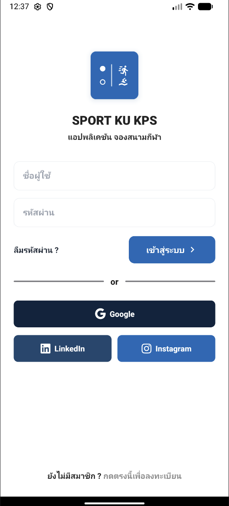
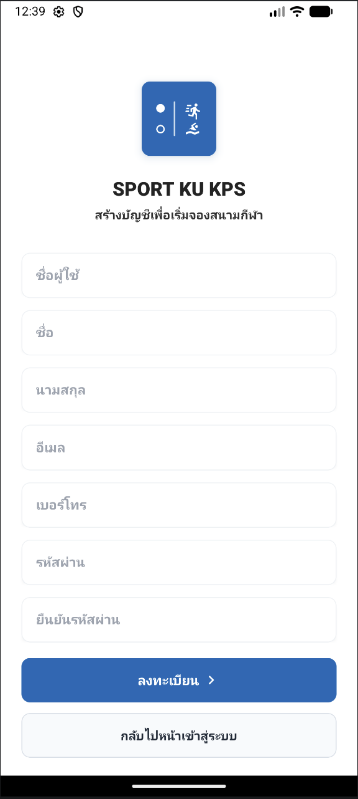
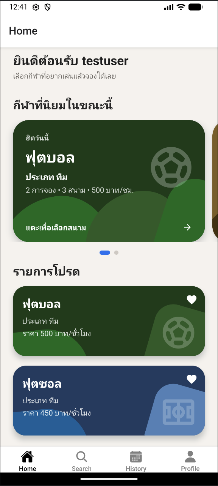
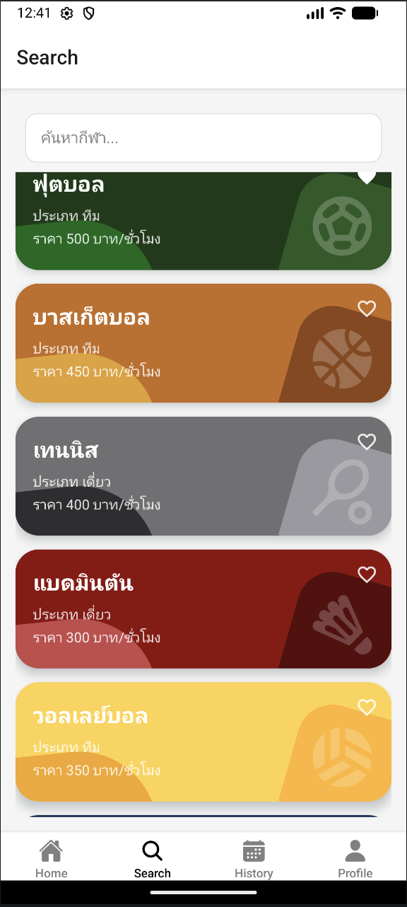
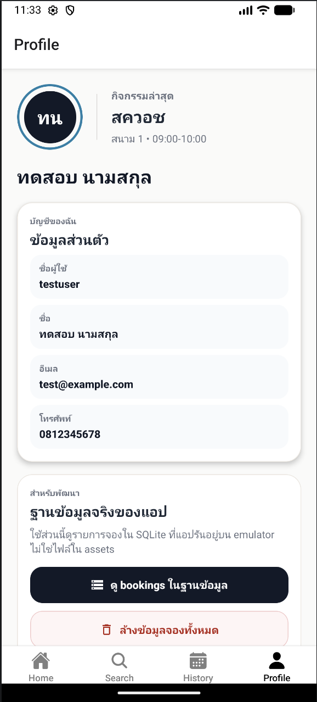
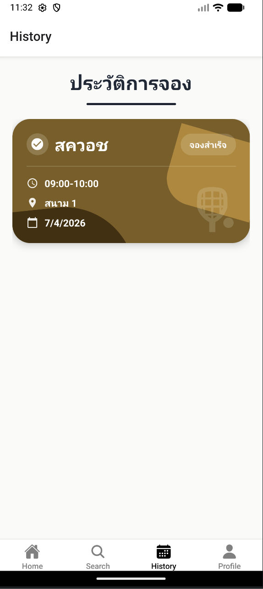

# SPORT KU KPS

แอปจองสนามกีฬาสำหรับมือถือ พัฒนาด้วย React Native + Expo ฝั่งแอป และ Express + SQLite ฝั่ง backend

ระบบนี้รองรับการสมัครสมาชิก, เข้าสู่ระบบ, ค้นหากีฬา, เลือกรายการโปรด, จองสนาม, ชำระเงินผ่าน PromptPay QR และดูประวัติการจองแยกตามผู้ใช้

## Screenshots

<table>
  <tr>
    <td align="center"><strong>Login</strong></td>
    <td align="center"><strong>Register</strong></td>
    <td align="center"><strong>Home</strong></td>
  </tr>
  <tr>
    <td></td>
    <td></td>
    <td></td>
  </tr>
  <tr>
    <td align="center"><strong>Search</strong></td>
    <td align="center"><strong>Profile</strong></td>
    <td align="center"><strong>History</strong></td>
  </tr>
  <tr>
    <td></td>
    <td></td>
    <td></td>
  </tr>
</table>

## Stack

- React Native 0.76
- Expo 52
- React Navigation
- Express.js
- SQLite3
- Axios
- AsyncStorage สำหรับเก็บรายการโปรด

## ฟีเจอร์หลัก

- สมัครสมาชิกและเข้าสู่ระบบ
- ค้นหาและดูรายการกีฬาทั้งหมด
- กดเพิ่มหรือลบรายการโปรด
- เลือกสนามและช่วงเวลาเพื่อจอง
- ป้องกันเวลาชนของสนามเดียวกัน
- ชำระเงินด้วย PromptPay QR
- ดูประวัติการจองตามผู้ใช้ที่ล็อกอิน
- แสดงกีฬายอดนิยมจากจำนวนการจองจริง

## โครงสร้างระบบ

โปรเจกต์นี้มี 2 ส่วนที่ต้องรันคู่กัน

1. Mobile app
- อยู่ใน Expo / React Native
- รับผิดชอบงาน UI และการนำทางในแอป

2. Backend API
- อยู่ใน Express server
- รับผิดชอบ login, register, bookings, popular sports และการอ่านเขียนฐานข้อมูล

ข้อมูลหลักของระบบถูกเก็บใน SQLite ผ่าน backend ไม่ได้เก็บประวัติการจองไว้ใน AsyncStorage แล้ว

## การติดตั้ง

```bash
npm install
```

## วิธีรันโปรเจกต์

เปิด 2 terminal

Terminal 1: รัน backend

```bash
npm run server
```

Terminal 2: รัน Expo

```bash
npx expo start
```

ถ้าต้องการล้าง Metro cache ให้ใช้

```bash
npx expo start --clear
```

## หมายเหตุการรัน

- ต้องเปิด `backend` และ `Expo` พร้อมกัน
- Android emulator จะเรียก backend ผ่าน `10.0.2.2:3000` อัตโนมัติ
- ถ้าใช้ iOS simulator หรือ web จะเรียกผ่าน `localhost:3000`
- ถ้าใช้มือถือจริง ต้องให้มือถือกับคอมอยู่ network เดียวกัน และตั้งค่า host ของ backend ให้เข้าถึงได้

## Scripts

```bash
npm run server     # เปิด Express backend
npm run start      # เปิด Expo dev server
npm run android    # build/run Android native app
npm run ios        # build/run iOS native app
npm run web        # เปิดเวอร์ชัน web
```

## โครงสร้างโฟลเดอร์

```text
assets/
  SportsCourtDB.db         SQLite database หลักของระบบ

src/
  components/              UI components ที่ใช้ซ้ำ
  data/                    ข้อมูลกีฬาเริ่มต้น
  screen/                  หน้าต่าง ๆ ของแอป
  services/
    api.js                 client สำหรับเรียก backend
    server.js              Express backend
    storage.js             AsyncStorage utilities
    database.js            local database helpers ที่เหลืออยู่ในโปรเจกต์
  utils/                   utility functions เช่น format ช่วงเวลา
```

## ฐานข้อมูล

ไฟล์ฐานข้อมูลหลักของระบบคือ

```text
assets/SportsCourtDB.db
```

ตารางสำคัญที่ใช้งาน

- `users`
- `sports`
- `courts`
- `time_slots`
- `bookings`
- `booking_time_slots`

การจองใหม่จะถูกบันทึกผ่าน backend ลง SQLite โดยตรง และประวัติการจองจะถูกดึงตาม `user_id` ของผู้ใช้ที่ล็อกอิน

## API หลัก

backend ปัจจุบันมี endpoint สำคัญ เช่น

- `POST /auth/register`
- `POST /auth/login`
- `GET /sports`
- `GET /popular-sports`
- `GET /sports/:sportId/courts`
- `GET /time-slots`
- `GET /bookings/booked-slots`
- `POST /bookings`
- `GET /users/:userId/bookings`

มี endpoint debug สำหรับ development เพิ่มเติมด้วย

- `GET /debug/bookings`
- `DELETE /debug/bookings`

## Development Notes

- หน้าโปรไฟล์มีส่วน debug ให้ดูรายการ bookings ในฐานข้อมูลจริงของแอปตอนรันโหมดพัฒนา
- ถ้า `npm run server` แล้วขึ้น `EADDRINUSE` แปลว่าพอร์ต `3000` ถูกใช้อยู่แล้ว ให้ปิด process เดิมก่อน
- ถ้าแอปไม่อัปเดตหลังแก้ UI ให้ลอง `npx expo start --clear`


## สถานะปัจจุบันของระบบ

- ฝั่งแอปใช้งาน backend จริงแล้ว
- ข้อมูลการจองแยกตามผู้ใช้
- รายการโปรดยังเก็บใน AsyncStorage ฝั่งเครื่อง
- กีฬายอดนิยมคำนวณจากจำนวนการจองจริงในฐานข้อมูล
